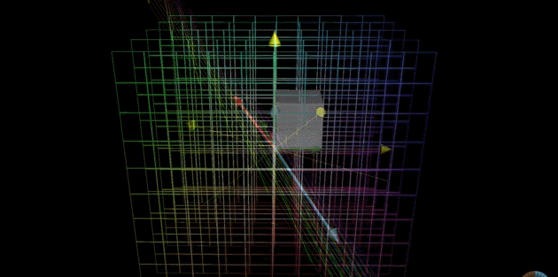
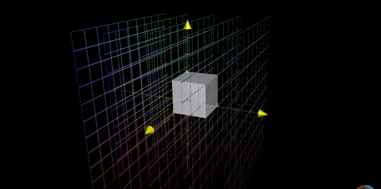
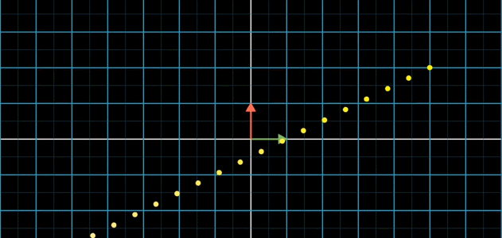

# Subspaces\(E7-E8\)

##  E7. Inverse matrices, column space and null space 

### 행렬의 유용함

* 선형 변환을 통해 공간을 조작할 수 있었다. \(그래픽스와 로봇공학에서 활용\)
* 뿐만 아니라, 행렬을 이용하여 **linear system of equations**도 풀 수 있다!  

### **Systems of linear equation**

* **변수들**
* scaled된 변수들과 그들의 addition으로만 이루어진\(즉, 선형인; linear\) **방정식** 
  * 선형방정식계는 $$A\vec{x}=\vec{v}$$로 나타낼 수 있다!  

### $$A\vec{x}=\vec{v}$$의 **기하학적 해석**:

* $$A$$로 표현되는 선형변환을 적용했을 때, $$\vec{v}$$의 위치로 오게될 벡터 $$\vec{x}$$를 찾아라!   

### $$A\vec{x}=\vec{v}$$가 해당될 수 있는 **두 가지 상황**:

#### CASE 1.$$A$$**가 모든 점들을 여전히 전체 space에 매핑하는 경우\(**$$det(A)\neq 0$$\).  

* 거의 대부분의 경우에 이에 해당될 것임. \(_most likely case_\) 
* '_행렬의 column들이 independent할 확률이 훨씬 높다_'는 이야기. 
* 단, square matrix가 주어지는 경우 가정\(방정식과 변수의 갯수가 동일\) 
* $$A$$를 통해 선형변환 후에 $$\vec{v}$$에 랜딩하는 유일한 벡터 $$\vec{x}$$가 반드시 존재한다. 
* $$\vec{x}$$는 $$A$$의 과정을 반대로 수행하는 역행렬 $$A^{-1}$$을 통해 구할 수 있다: $$\vec{x}=A^{-1}\vec{v}$$
* 원래 변환에 역변환을 연달아 수행하면 '_아무 것도 하지 않은_' 것과 같다: $$A^{-1}A=I$$

#### CASE 2.$$A$$**가 모든 점들을 더 저차원의 subspace로 찌부러뜨리는 경우\(**$$det(A)=0$$\). 

* 아래 그림 참조. 
* square matrix가 주어졌다고 하더라도,  dependent column이 존재하는 경우. 
  * 실제로는 tall matrix나 마찬가지. \(전체 공간을 span할 column이 부족\) 
  * 해의 개수에 비해서 방정식 개수가 더 많은 셈. \(나중에 검증!!!\)  
* 이때는 상대적으로 매우 작은 subspace에 선형 변환 결과가 제한되게 된다. 
  * 즉, 대부분은 $$\vec{v}$$가 subspace 위에 존재하지 않을 확률이 크다. 
* 해의 존재에 대한 변수는 다음 두 경우로 나뉜다. 
  1. \*\*\*\*$$\vec{v}$$가  ****subspace 위에 존재하지 _않는_ 경우: **해가 존재하지 않음.** \(most likely\)
  2. \*\*\*\*$$\vec{v}$$가  ****subspace 위에 존재하는 경우: **무수히 많은 해가 존재.** \(rarely and luckily\) 
* 2번의 경우에는 역행렬을 통해 원래 vector를 되살려낼 수 없음. 
  * 변환 후,  $$\vec{v}$$위치에 랜딩하는 무수히 많은 $$\vec{x}$$가 존재하기 때문!  
  * function은 하나의 입력에 여러 개의 출력을 갖을 수 없다. 

### **Rank**

* $$det(A)=0$$인 경우, 변환 후에 '**얼마나 작은**' subspace에 갇히게 되었는지는 구별할 수 없다. 
* 3차원 벡터공간을 예를 들어보자. 
  *  변환의 결과가 평면인지 선인지에 따라 해를 구할 수 있는 가능성은 달라진다. 
  * 그러나 둘 다 똑같이 determinant는 zero이다. 
* 이 때 rank라는 개념은 이 둘의 차이를 나타낼 수 있다. 
  * **평면**일 경우: **rank 2**
  * **선**일 경우: **rank 1**
* 즉, rank는 **출력의 차원수**를 의미한다. 
* **Full rank**\(최대 rank\)인 경우, 변환 후에도 전체 차원을 그대로 유지 가능하다. \($$det(A)\neq 0$$\)

### **Column space**

* **모든** $$\vec{x}$$**에 대한 선형변환의 결과값**$$A\vec{x}$$를 $$A$$의 **column space**라고 한다. 
  * 위에서 말했던 '변환의 결과가 갇히게 되는 subspace'에 이름을 붙인 것 뿐이다.
* $$A$$의 column vector들이 span하는 subspace이므로\(_**span of columns**_\) 이러한 이름을 갖는다. 
* **rank의 또다른 정의**는 '**column space의 차원**'이다. 
* 영벡터는 항상 column space에 포함된다. \(선형변환은 원점의 위치가 변하지 않으므로\) 

### **Null space / Kernel**

* Nullspace는 선형변환 후 원점으로 짜부러지는 subspace이다. 

#### **Full rank일 때**

* 선형변환의 과정에서 **오직 영벡터 자기 자신**만이 **영벡터에 랜딩**한다.  

#### **Full rank가** _**아닐**_ **때**

* **줄어든 rank와 동일한 차원의 subspace**가 **영벡터에 랜딩**한다.  
* 즉, 변환과정에서 차원이 축소되면서 그 감소분이 원점으로 빨려들어가는 것이다.  
* 이렇게 원점으로 collapse되는 subspace를 위에서 설명한대로 nullspace라고 한다. 
* 이는 ****$$A\vec{x}=\vec{0}$$**의 solution**과 정확히 같다. \(변환 후에 zero vector되는 $$\vec{x}$$ 찾기\)   

### 전체 그림 

#### 선형변환\(linear transformation\)의 과정에는 다음 두가지가 동시에 일어난다. 

1. 전체 공간\(row space\)이 column space로 변화 
2. null space가 zero vector로 빨려들어감 

#### 즉, null space가 원점으로 빨려들어가면서 column space가 드러난다. 

* null space는 **선형변환 이전**에 관찰 가능. \(변환 후에는 이미 원점으로 collapsed\) 
* column space는 **선형변환 이후**에 관찰 가능. \(변환의 결과이므로 당연\) 

## E8. Non-square matrices as transformations between dimensions

### Non-square matrices

* E7에서는 같은 차원 사이의 선형 변환을 나타내는 square matrix만을 고려. 
  * $$(3\times 3)$$행렬은 3차원에서 3차원으로의 변환 
* non-square matrix는 서로 다른 차원 사이의 mapping을 의미한다.

#### 행렬 $$\begin{bmatrix} 2 & 0 \\ -1 & 1 \\ -2 & 1 \end{bmatrix}$$은 다음과 같은 선형 변환을 의미한다.

* **입력**: 2차원이다.
* **출력**: 공간 전체는 3차원이지만, column space는 2차원이다. **\(rank 2\)** 
* 아래 그림 참조.

#### 행렬 $$\begin{bmatrix} 3&1&4\\1&5&9 \end{bmatrix}$$는 다음과 같은 선형 변환을 의미한다. 

* 상당히 counter-intuitive하다. 
  * 어쨌든 출력 차원에서 3개의 column의 선형 조합으로써 매핑가능. 
* 선형방정식계로 치면 방정식보다 변수가 많은 경우. 
  * 반드시 하나 이상의 방정식은 redundant하다.
  * 같은 지점을 표현할 수 있는 linear combination이 unique하지 않다. 
  * 예를 들어, 다음 두 개의 입력은 같은 출력 $$[2, 1]^\top$$을 갖는다.
    * $$[1, 1, 1]^\top, \ \ [9/14, 1/14, 0]^\top$$

#### 두번째 그림의 상황이 과연 linear transformation이 맞을까? 

* 일단 function은 맞다. 다수의 입력이 하나의 출력\(many-to-one\)을 가질 수 있다.
  * 반대의 경우\(하나의 입력이 다수의 출력을 갖는 경우\)는 함수가 아님. 
* 선형 변환 후에도 원점은 문제없이 고정되어 있다. 
* 그렇다면 변환 후에도 linear한 특성이 유지가 될까? \(parallel & evenly-space\) 
  * many-to-one의 특성은 n차 다항식이나 삼각함수 등\(non-linear\)을 연상케 한다.  
* \(주의\) 이 부분에서 선형성에 의심을 제기하는 것이 기본 개념이해에 치명적인 것은 아니다. 
  * 그러나 이해의 심화에는 도움이 될 것 같다. 
  * 여튼 **고차원에서 저차원으로의 변환도 여전히 선형이다**는 것이 중요하다. 

#### \(내 생각에는\) 위 상황에서도 linearity가 유지된다.   

* 가장 mental image로 시각화하기 쉬운 예를 들어보면, 

1. 3차원의 \(입력\)공간에 standard basis vector 3개가 놓여있다.  
2.  $$[10, 10, 10]^\top$$쯤의 위치에서 원점을 바라본다고 하자. 
3. 원점 넘어의 반대편 공간, 임의의 거리에 slide용 2차원 \(출력\)평면이 존재한다고 상상해보자.  
4. 바라보는 방향으로 정사영\(orthogonal projection\)을 해보자. 
5. 위 그림의 오른쪽 상황과 비슷한 그림이 나올 것이다. 
6. 출력 평면\(2d\)에 같은 점에 매핑되는 입력 공간\(3d\)안의 직선\(1d\)들 상상할  수 있을 것이다.   
7. 이 직선들은 slide에 수직인 모든 직선이다.   
8. 이 직선의 차원\(1\)은 입력 공간\(3\)에서 출력 공간\(2\)으로 넘어오면서 소실된 차원\(3-2\)이다.  
9. 이제 입력 공간에서 아무 눈금직선\(등간격으로 마킹되어 있는 직선\)을 그려보자. 
10. 출력 공간에서도 그 눈금직선의 정사영은 역시나 직선이고 그 눈금도 등간격일 것이다. 
11. 단, 6번에서의 직선들은  하나의 점에 매핑된다. \(이 부분이 violation?\) 
12. 1번에서 가정했던 basis들의 각도를 이리저리 움직이거나 scaling을 해보자.  
13. 상상하기 쉽진 않지만 10번에서 살펴본 linearity가 훼손되지 않음을 알 수 있다.  

#### 더 상상하기 쉬운 저차원에서 linearity에 대한 직관을 얻을 수도 있다. 

* **2차원에서 1차원으로 선형 변환**이 일어나는 예시\(**아래 그림**\)로도 직관적인 이해가 가능하다.
* 랜덤한 evenly-spaced 점들을 선형 변환해서 1d로 찌부러뜨리더라도 여전히 등간격이다. 
  * 즉, 선형 변환 후에도 linear하다.  
* 이때도 역시 출력 직선 위의 하나의 노란 점에 매핑하는 직선이 존재 \(nullspace와 유사\) 
  * 11번과 같은 현상이지만, 영상에서도 문제삼지 않는다. \(violation x\)  
* 더 엄밀한 linearity에 대한 정의는 MML 책에서 다룰 것이다. 
  * 이 강의의 E15에서도 잠시 소개한다. 

